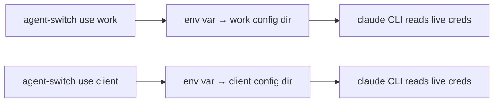

`@event4u/agent-switch` switches between multiple accounts of AI coding-agent CLIs on macOS, Linux, and Windows with a single shell command — no repeated browser login/logout when you move between accounts.

## The problem with credential snapshotting

Naive account switchers snapshot the OS keychain entry for the active account and restore it when you switch back. This breaks: OAuth refresh tokens rotate on every refresh, so a snapshot goes stale within hours. You end up re-authenticating anyway.

## Config-dir isolation

agent-switch takes a different approach. Each profile gets its **own config directory**, and each provider's CLI derives a separate, live credential per config dir. Switching only changes which directory new invocations point at — nothing is snapshotted, nothing goes stale, and each account logs in via the browser exactly once.

## Supported providers

The CLI defaults to `claude` throughout; pass `--provider codex|antigravity` to target another provider.

| Provider | Binary | Env var | Credential location | Usage readout |
|---|---|---|---|---|
| `claude` (Claude Code) | `claude` | `CLAUDE_CONFIG_DIR` | macOS Keychain (hashed per dir) / `.credentials.json` | Yes |
| `codex` (OpenAI Codex) | `codex` | `CODEX_HOME` | `<dir>/auth.json` (`0600`) | Yes |
| `antigravity` (Google Gemini `agy`) | `agy` | `HOME` (CLI nests `.gemini/`) | Per-profile keychain via go-keyring | No (identity only) |

## Next

Continue to [Installation & Setup](/agent-switch/getting-started/installation/).
