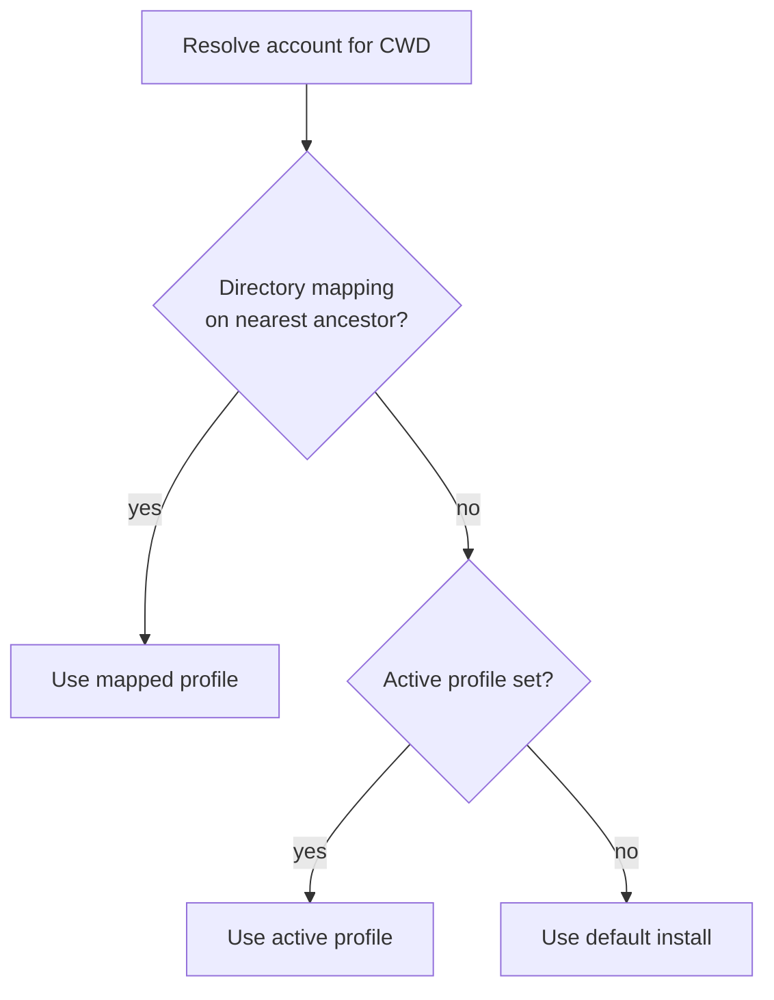

Two features keep multi-account work frictionless: **directory mappings** pin a repo to a profile so the right account is picked automatically, and **config sharing** links your Claude settings, memory, skills, and commands across every profile.

## Directory → profile mappings

Map a directory to a profile once, then `cd` into it and get the right account without activating anything by hand.

| Command | What it does |
| --- | --- |
| `agent-switch map <name> [dir]` | Map a directory (default: CWD) to a profile |
| `agent-switch unmap [dir]` | Remove a directory mapping |
| `agent-switch mappings` | List all directory mappings |
| `agent-switch dir [--provider P]` | Resolve the config dir for the CWD |

```bash
# Pin the current repo to your "work" profile
cd ~/code/acme-app
agent-switch map work

# From now on, running an agent here uses the work account
agent-switch mappings
```

`agent-switch dir` is used internally by the shell wrapper to resolve which config directory applies to the CWD. An empty result means the default install is used.

### Resolution precedence

When resolving which account applies, agent-switch checks sources in order and uses the first match. A directory mapping on the **nearest ancestor** of your CWD wins over the active profile, which wins over the default install.



:::note
Because the nearest-ancestor mapping wins, a mapping on `~/code/acme-app` applies to every subdirectory of that repo, and a more specific mapping deeper in the tree would override it.
:::

## Sharing Claude config across profiles

Sharing links a single source-of-truth Claude config into every profile, so your `settings.json`, `CLAUDE.md`, skills, commands, and agents stay consistent no matter which account you're on. This is **Claude-only**.

```bash
agent-switch share on --source work     # link work's config into every profile
agent-switch share status --json        # inspect current share state
agent-switch share sync                  # re-link after changes
agent-switch share off                   # unlink
```

| Argument | Purpose |
| --- | --- |
| `on` / `sync` / `off` / `status` | Enable, re-link, disable, or inspect sharing |
| `--source <profile\|default>` | Which profile (or the default install) is the source of truth |
| `--history` | Also share conversation history (POSIX only) |
| `--json` | Machine-readable output |

### What gets linked, and how forking works

Sharing links `settings.json`, `CLAUDE.md`, `skills/`, `commands/`, and `agents/` from the source profile into every profile.

- **Directories** (`skills/`, `commands/`, `agents/`) are write-through symlinks — edits in any profile hit the shared source.
- **Individual files** (`settings.json`, `CLAUDE.md`) **fork** on a `/config` edit, so a per-profile change doesn't clobber the shared source.

Run `agent-switch share sync` after adding or changing files to re-link everything.

:::caution[Windows sharing requirements]
On Windows, directory sharing uses junctions (no admin rights needed). File sharing relies on symlinks, which require **Developer Mode** to be enabled.
:::

## See also

- [CLI reference](/agent-switch/reference/cli/)
- [Sessions & handoff](/agent-switch/guides/sessions-and-handoff/)
